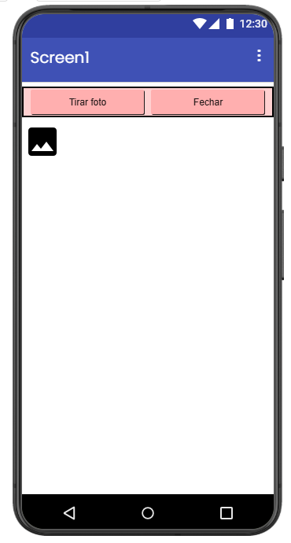
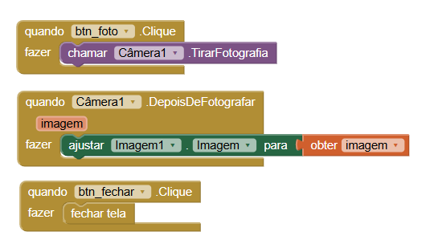
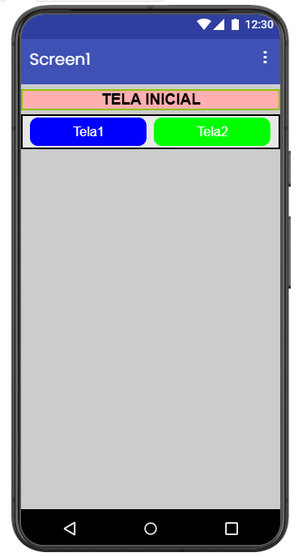
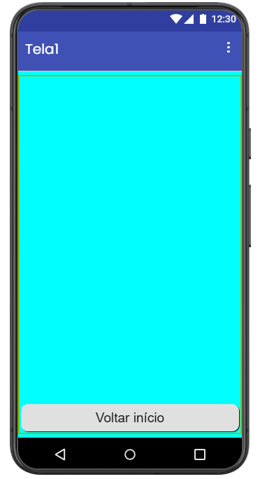
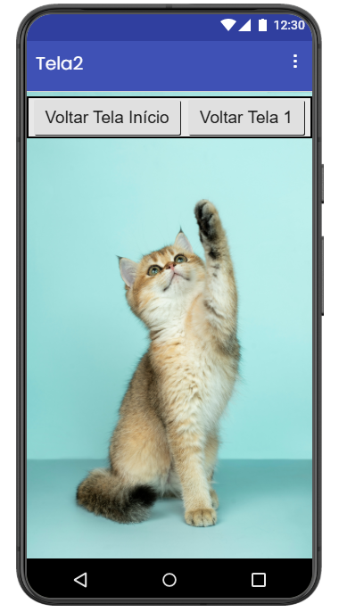
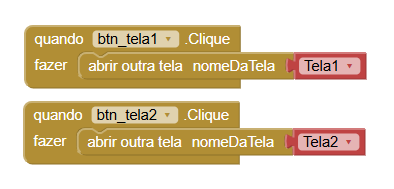
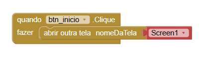
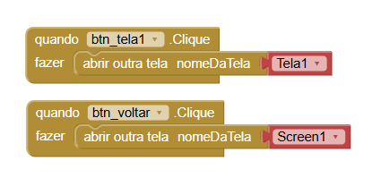
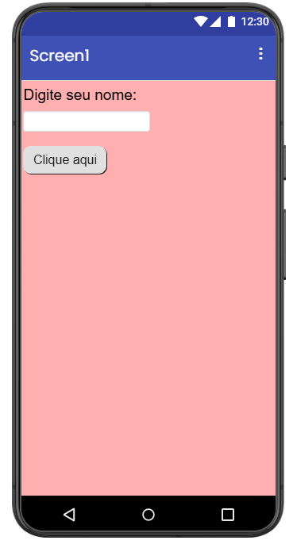
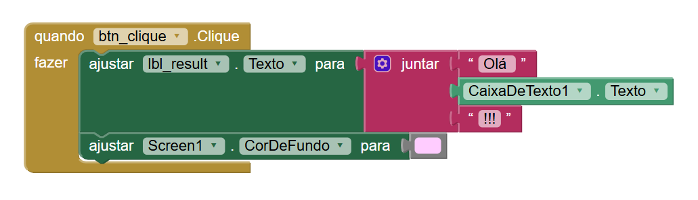

# Relatório – Desenvolvimento de Aplicativos (App Inventor)

## Centro Paula Souza
Etec Vasco Antonio Venchiarutti - Jundiaí SP

## Curso
Técnico em Desenvolvimento de Sistemas Integrado ao Ensino Médio

## Turma
2ºC1

## Autores
Henrique Silvestre Martin
Isabella Fernanda da Silva Barbosa

---

# Projeto 1 – Primeiro Aplicativo (pg. 27)

### Descrição
Objetivo, funcionalidade e modificações.

## Print do Design
Colocar imagem

## 🔗 Print dos Blocos
Colocar imagem

---

# Projeto 2 – Segundo Aplicativo (pg. 46)

## Descrição
Objetivo, funcionalidade e modificações.

## Print do Design
Colocar imagem

## Print dos Blocos
Colocar imagem

---

# Projeto 3 – Terceiro Aplicativo (pg. 56)

## Descrição
Objetivo, funcionalidade e modificações.

## Print do Design
Colocar imagem

## 🔗 Print dos Blocos
Colocar imagem

---

# Projeto 4 – Quarto Aplicativo (pg. 64)

## Descrição
O projeto “Usando a câmera” tem como objetivo utilizar o recurso da câmera do celular para que o usuário tire uma foto. Ao clicar no botão “tirar foto”, o aplicativo acessa a câmera do celular do usuário e tira uma foto, exibindo-a em seguida. Em relação ao modelo da apostila, foi otimizada a organização dos botões e alterado o tamanho dos botões.

## Print do Design

## Print dos Blocos

---

# Projeto 5 – Quinto Aplicativo (pg. 69)

## Descrição
O projeto “Várias telas” tem como objetivo permitir que o usuário acesse diferentes telas do aplicativo. Partindo da tela inicial, o usuário pode acessar a tela 1 (que permite apenas voltar a tela inicial) e a tela 2 (que acessa a tela inicial ou a tela 1). Em comparação ao modelo apresentado na apostila, alterações na aparência foram realizadas para melhorar a experiência do usuário, como mudanças no alinhamento dos botões, largura dos botões e cores de fundo.

## Print do Design

## Print dos Blocos

---

# Projeto 6 – Sexto Aplicativo (pg. 82)

## Descrição
O projeto “Teclado” tem como objetivo exibir uma mensagem com o nome do usuário. Ao dar a instrução de digitar o nome do usuário na caixa de texto, após o clique do botão de ação é exibida uma mensagem personalizada com o nome digitado. Em relação ao modelo apresentado, foi realizada a separação do botão de ação do comando de digitar, além da troca de cor de fundo e a adição da função de trocar a cor de fundo ao exibir a mensagem.

## Print do Design

## Print dos Blocos

