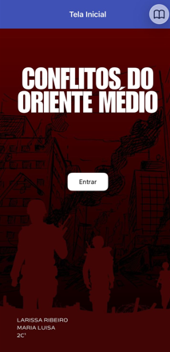
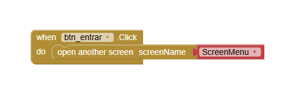
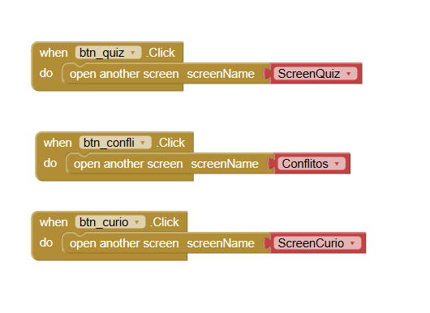
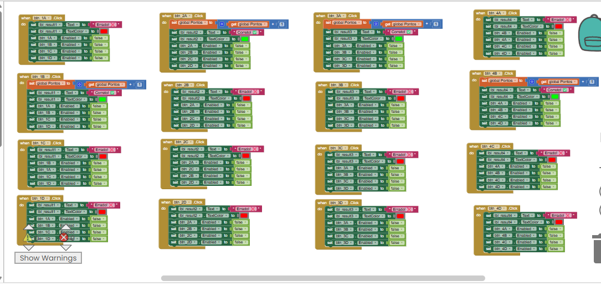
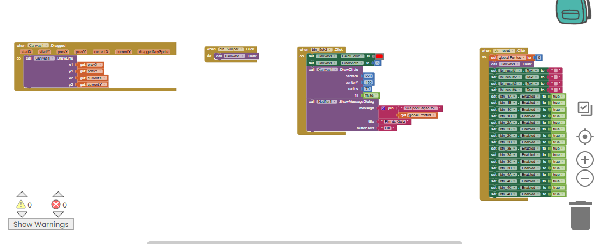

# Instituição
ETEC Vasco Antônio Venchiarutti (ETEC VAV)

# Curso
Desenvolvimento de Sistemas

# Turma
2C1

# Autores
Larissa Ribeiro  
Maria Luisa Gibrail  

# Projeto

## Título
Aplicativo de Conflitos Históricos e Curiosidades

## Descrição

O objetivo do aplicativo é apresentar conteúdos educativos sobre conflitos históricos e curiosidades de forma interativa, utilizando um aplicativo mobile desenvolvido no App Inventor.

O aplicativo possui uma tela inicial simples, que direciona o usuário para um menu principal. A partir do menu, o usuário pode acessar três áreas principais:

- Tela de Conflitos  
- Tela de Curiosidades  
- Tela de Quiz

  
  ### Funcionamento do aplicativo

- Tela Inicial: possui um botão que leva ao menu principal.  
- Menu: permite navegar entre as telas de conflitos, curiosidades e quiz.  

- Tela de Conflitos: apresenta informações sobre:
  - Conflito entre Israel e Palestina  
  - Guerra do Golfo  
  - Guerra Irã-Iraque  

- Tela de Curiosidades: apresenta fatos históricos interessantes, como:
  - Samurais e armas de fogo  
  - Elefantes de guerra na Índia  
  - A Grande Muralha como sistema militar  

  Ao final da tela, há uma funcionalidade interativa onde o usuário pode clicar na imagem de uma bomba e ouvir um efeito sonoro.

- Tela de Quiz: contém 4 perguntas relacionadas ao conteúdo do aplicativo.  
  No final, há um teste de conhecimento onde o usuário tenta identificar o lugar mais seguro, podendo visualizar o resultado e reiniciar o quiz.

# Print das telas do Design

## Tela Inicial

## Tela Menu

## Tela Quiz
  
  

# Print das telas dos Blocos

## Tela Inicial

## Tela Menu

## Tela Quiz
  

