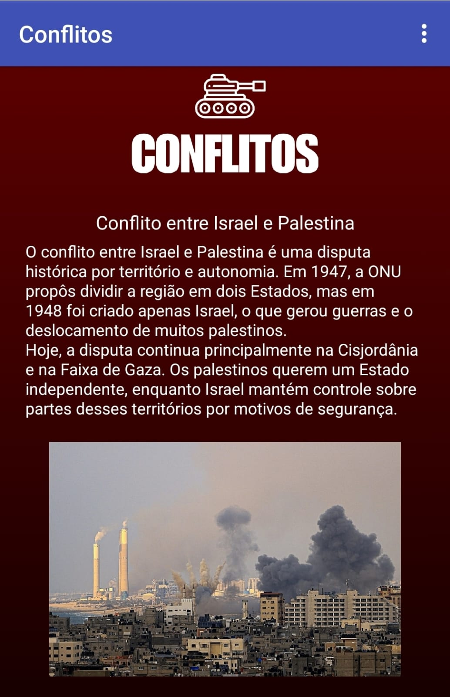
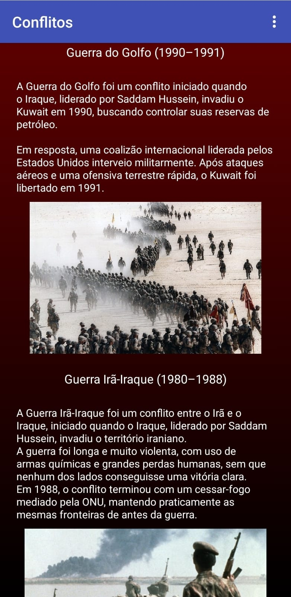
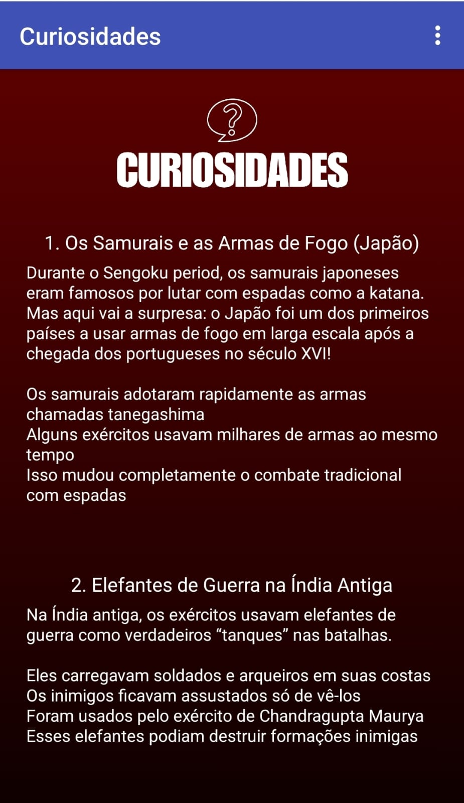
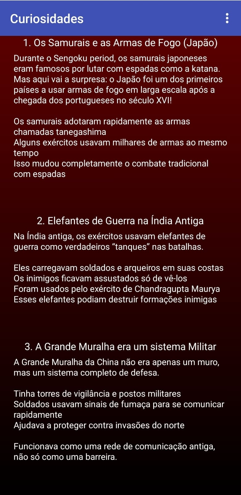

# Instituição
ETEC Vasco Antônio Venchiarutti (ETEC VAV)

# Curso
Desenvolvimento de Sistemas

# Turma
2C1

# Autores
Larissa Ribeiro  
Maria Luisa Gibrail  

# Projeto

## Título
Aplicativo de Conflitos Históricos e Curiosidades

## Descrição

O objetivo do aplicativo é apresentar conteúdos educativos sobre conflitos históricos e curiosidades de forma interativa, utilizando um aplicativo mobile desenvolvido no App Inventor.

O aplicativo possui uma tela inicial simples, que direciona o usuário para um menu principal. A partir do menu, o usuário pode acessar três áreas principais:

- Tela de Conflitos  
- Tela de Curiosidades  
- Tela de Quiz

  
  ### Funcionamento do aplicativo

- Tela Inicial: possui um botão que leva ao menu principal.  
- Menu: permite navegar entre as telas de conflitos, curiosidades e quiz.  

- Tela de Conflitos: apresenta informações sobre:
  - Conflito entre Israel e Palestina  
  - Guerra do Golfo  
  - Guerra Irã-Iraque  

- Tela de Curiosidades: apresenta fatos históricos interessantes, como:
  - Samurais e armas de fogo  
  - Elefantes de guerra na Índia  
  - A Grande Muralha como sistema militar  

- Tela de Quiz: contém 4 perguntas relacionadas ao conteúdo do aplicativo.  
  No final, há um teste de conhecimento onde o usuário tenta identificar o lugar mais seguro, podendo visualizar o resultado e reiniciar o quiz.

## Conceitos utilizados

Durante o desenvolvimento do aplicativo, foram aplicados diversos conceitos estudados na apostila, como:

- Criação de interface gráfica (Design das telas)
- Programação em blocos no App Inventor
- Uso de eventos de clique (botões)
- Navegação entre telas (open another screen)
- Organização lógica do aplicativo
- Interação com o usuário

## Componentes utilizados

- Botões  
- Labels (textos)  
- Imagens  
- Componentes de mídia (som)  
- Layouts de organização  
- Blocos de programação para navegação e lógica

## Diferenciais do projeto

O aplicativo apresenta uma proposta original com foco em educação histórica, incluindo:

- Organização por categorias (Conflitos, Curiosidades e Quiz)  
- Interface visual personalizada  
- Uso de imagens e textos explicativos  
- Elemento interativo com som  
- Sistema de quiz com resultado e reinício

# Print das telas do Design

## Tela Inicial

## Tela Menu

## Tela Quiz
  
  

## Tela Conflitos
  

## Tela Curiosidades

# Print das telas dos Blocos

## Tela Inicial

## Tela Menu

## Tela Quiz
  

